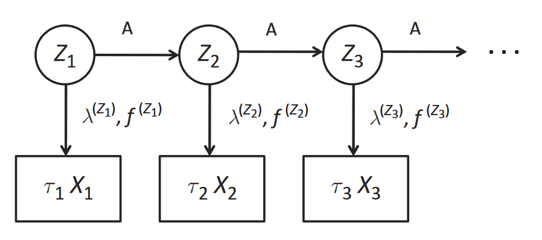

# EM-HMM for High-Frequency Financial Data

This repository contains a Python implementation of an Expectation-Maximization (EM) algorithm for estimating the parameters of a Hidden Markov Model (HMM) specifically designed for analyzing high-frequency financial time series data. The methodology implemented here is largely based on the paper:

*   **"Modelling Asset Prices for Algorithmic and High-Frequency Trading" by Álvaro Cartea & Sebastian Jaimungal.** [See here!](https://www.tandfonline.com/doi/full/10.1080/1350486X.2013.771515)

## Overview

The goal is to model the dynamics of asset prices in a high-frequency trading context, capturing different market conditions (regimes) and their impact on price movements and trading activity.  An HMM is used to represent these regimes, and the EM algorithm is used to learn the model parameters from data.

## Key Features

*   **HMM for Financial Data:** Models asset prices using hidden states (regimes), price revisions, and durations between trades, capturing market microstructure dynamics.
*   **Explicit Modeling of Zero Price Revisions:** Addresses the importance of explicitly modeling periods where trades occur without price changes.
*   **Data Simulation:** Provides functions for simulating financial time series data with hidden Markov states, allowing for testing and validation of the algorithm.
*   **EM Algorithm:** Implements the EM algorithm for estimating HMM parameters from data.
*   **Numerical Stability:**  Uses logarithms extensively to prevent underflow issues in probability calculations.
*   **Clear and Documented Code:**  Well-commented code with docstrings explaining the purpose, arguments, and return values of each function.


## Usage

1.  **Run the Code:**

    Execute the `hmm_em.py` script:

    ```bash
    python EM_HMM.py
    ```

    This will:

    *   Simulate financial time series data using pre-defined or customized parameters.
    *   Estimate the HMM parameters using the EM algorithm.
    *   Plot the log-likelihood over iterations to assess convergence.
    *   Plot the data simulation and highlight the regime where a value was generated from

2.  **Customize Parameters:**

    Modify the `params` dictionaries (e.g., `params2`, `params4`) to experiment with different HMM configurations.  These dictionaries define:

    *   `transition`: The transition matrix between hidden states.
    *   `lmbd`: The rates of trade arrival.
    *   `zprob`: Probabilities of zero price revisions.
    *   `sigma`: Standard deviations of price revisions.
    *   `log_initProb`: This is log of the probabilities for the initial states

4.  **Analyze Results:**

    The code will print the estimated HMM parameters to the console and generate plots of the log-likelihood function.  Analyze these outputs to assess the model's fit and identify characteristics of the different market regimes.


## Understanding Market Microstructure

This section lays the groundwork for understanding how price processes work in electronic financial markets, focusing on the factors that influence price formation. It introduces key concepts and terminology essential for effectively applying HMMs to model market behavior.

### 1. Orders and the Exchange

*   **Electronic Markets:** Electronic markets provide a platform for traders to signal their willingness to trade, using matching engines to connect buyers and sellers.
*   **Order Types:**
    *   **Market Orders (MOs):** Aggressive orders seeking immediate execution at the best available price. They result in immediate trades.
    *   **Limit Orders (LOs):** Passive orders indicating a desire to buy or sell at a specific price or better, up to a maximum quantity. They are not immediately executed and are placed in the Limit Order Book (LOB).

### 2. The Limit Order Book (LOB)

*   **Definition:** The LOB is an electronic record of all outstanding limit orders, managed by the matching engine. It tracks incoming and outgoing orders, enabling the execution of a trade if both buying and selling prices meet.
*   **How LOBs Work:**
    *   **Addition of LOs:** Incoming LOs join the LOB at the specified price level, placed in the queue based on time priority (first-in, first-out).
        *  
        *  
        *  
    *   **MOs Walk the LOB:** Incoming Market Orders (MO) will take, or "walk," liquidity from the LOB.
        *   The matching engine matches the MO with existing LOs, based on price and then time priority.
        *   This results in partial or full execution of the MO, depleting the LOB at the corresponding price levels.
        *  
*   **Discrete Price Levels:** The LOB operates on a discrete price grid, where each step is defined by the "tick" size.
*   **LOB Snapshots:** Shows a sample plot of the limit order book (LOB) on NASDAQ for two stocks, FARO and HPQ:
    *   
        *   Blue bars represent the available sell LOs, red bars represent the available buy LOs.
        *   The best sell price is ask, best buy price is bid, and the difference between the ask and the bid price is the quoted spread.

### 3. Price Process - Dynamic LOB

*   **Dynamic LOBs:** The evolution of the LOB in time, showing the continuous interaction of MOs and LOs. The interplay of these orders helps in generating the time evolution of the price and therefore it's important to measure the number of buy or sell side orders.
    *   The blue regions on top represent the ask side of the LOB, the posted sell volume, while the bid side is below in red, showing the posted buy volume. The best prices, the bid and ask are identified by the edges of the intermediate light shaded beige region, which identifies the bid-ask spread.
    *   
    *   
    *   
*   **Microprice:** The microprice helps show how the price has to change either towards the bid or ask side. *If there are a lot of buyers (sellers), then the microprice is pushed toward the best ask/bid price to reflect the likelihood that prices are going to increase (decrease).*

## Modeling and Simulation - Building the HMM for Price Processes

This section details the creation of a finite-state Hidden Markov Model (HMM) to represent price processes, as well as the data simulation. The HMM serves as a framework applicable to algorithmic and tick-by-tick trading design.

### 1. Modeling

*   **HMM Framework:**
    *   Employs a discrete-time Markov chain, *Zt*, with a transition matrix *A*, to model the underlying states of the market.
    *   The time index in the Markov chain represents the number of trades that have occurred.
    *   Within each state (or regime), trade arrivals follow a regime-dependent hazard rate, *At = X(Zt)*.
    *   Price revisions are distributed according to a discrete-continuous mixture model.
        *   The discrete part models zero price revisions.
        *   The continuous part models non-zero price revisions, with parameters dependent on the current market state.
    * PDF for price revisions is given by function to get the log mix of the models for each regime:
    *   "fX\Zt=k(x) = p(k) δ(x) + (1 - p(k))g(k)(x)*"
        *   *δ(x)*: Probability mass at x = 0 (Dirac measure), where the state is at zero
        *   *g(k)(x)*: Continuous distribution of non-zero price revisions
        *   *p(k)*: Probability of a zero price revision

        *   
        *   The intraday states Zt evolve according to the discrete time Markov chain with transition matrix *A*.
        *   Trades arrive at a rate of  and have price revisions with pdf . Once a trade occurs, the world state evolves.
* **Mathematical representation:** Models the tick-by-tick process of the asset, with the given data,  with the model  equation

### 2. Simulation

*   The defined model allows the generation of artificial data by sampling from the distribution, for example data by states where prices are not moving.
*   The author simulates a tick-by-tick sample path of stock prices using a two-state and a four-state HMM (respectively) with parameters given in Tables 3.1 and 3.2.

*[Table: Model parameters with 2 regimes]*

```
Regime   A         λ      p      σ
-------  --------  -----  -----  ----------
1        0.80 0.20 1.37   0.56   2.9 * 10-4
2        0.43 0.56 0.14   0.14   6.3 * 10-4
```


Data simulated according to this 2 regimes model.

*[Table: Model parameters with 4 regimes]*

```
Regime   A        λ        p        σ
-------  -------  -------  -------  -----------
1        0.7988   0.0305   0.0004   0.1703    2.614   0.8557   1.810 * 10-4
2        0.0114   0.9448   0.0118   0.032     2.101   0.4657   2.931*10-4
3        0.0305   0.1864   0.7595   0.0236    1.203   0.2634   11.48 *10-4
4        0.4308   0.006    0.0008   0.5624    0.487   0.2906   2.496 * 10-4
```

**

Simulated data with 4 regimes 

## Estimation of Parameters - Applying the EM Algorithm

This chapter presents the application of the Expectation-Maximization (EM) algorithm for estimating the parameters of the Hidden Markov Model (HMM) that were formulated in the earlier chapters.

### 1. EM Algorithm Implementation

*   **Goal:** Use the Baum-Welch EM algorithm to estimate:
    *   Transition probability matrix (*A*)
    *   Within-regime model parameters (*θ = {p, λ, σ}*)
    *   Initial distribution of the regimes (*π*)
*   **Methodology:**
    *   Maximize the log-likelihood of the sequence of observations *(Tt, Xt)*, where:
        *   *Tt*: Duration since the last trade
        *   *Xt*: Log-price innovation at time *t*

### 2. Experiment Results

*   The algorithm was implemented on simulated data for both two-state and four-state regimes.
*   Tables 4.1 and 4.2 display the parameter estimates based on 100 samples of the HMM, which are graphically illustrated in Figures 3.2 and 3.3 of Chapter 3.
*The estimated paramenters are not precise due to small samples
*

*[Table 4.1: Estimated Parameters with 2 Regimes]*
```
Regime     A        λ       p         σ
---------  -------  ------  --------  -----------
1          0.99 0.01   1.27    0.0004    3.82 * 10-4
2          0.99 0.01   1.18    0.6614    3.84 * 10-4
```


## Conclusion

This project demonstrates the application of Hidden Markov Models (HMMs) and the Expectation-Maximization (EM) algorithm to financial time series data, specifically in the context of high-frequency trading. By modelling the hidden states of the market, the algorithm learns the duration, price, and transition dynamics and may allow identifying valuable insights for algorithmic traders.

## Future Work

*   **Integration with Real Data:** Adapt the code to load and process real-world financial data.
*   **Model Selection:** Implement criteria for selecting the optimal number of hidden states (e.g., Bayesian Information Criterion (BIC)).
*   **Trading Strategy Development:**  Develop and test trading strategies based on the estimated HMM parameters, as suggested in the original paper.
*   **Extend the model** Add news and events as components of the HMM

